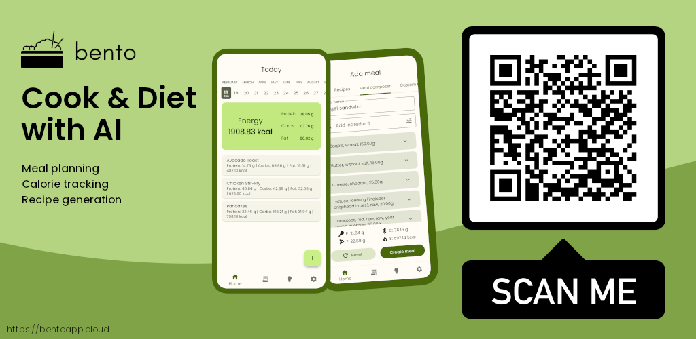

## Hi there, I'm Mateusz!

I enjoy expanding my knowledge, indulging in video games, and crafting pixel art. My interests encompass AI, game
development, and hands-on DIY projects.

### Stack

## Current job

I work as a senior java developer at Tooploox.

## Personal stuff highlights

### [Bento](https://bentoapp.cloud)

Currently, In my free time this is a project I am focused on.

Main features of the app:

- Macronutrients and kcal tracking
- Meal composing and scheduling
- Recipe storage and generation

Backend consists of a few microservices I've developed using **Kotlin** along with **Ktor**. For data storage, I used
**PostgreSQL** databases. Everything is wrapped up in a **Kubernetes** cluster (deployed to the cloud) which exposes a
**GraphQL** endpoint. Additionally, for monitoring, I use the **Grafana-Prometheus-Loki** stack.

For the frontend, I use **Flutter**, mostly because of the flexibility it provides, but also simply because I enjoy
using it.

The app is currently available on Android and you can either get it [here](https://www.bentoapp.cloud) or by scanning
the QR code below.

### Sokoban-like game I abandoned a bit

I developed a Sokoban-style game where player assumes the role of a rogue, navigating through dungeons to
help retrieve gnomes' treasure. The objective is to strategically push crates and so on, to clear a path for the
treasure to reach the elevator, advancing to the next level. The game also features pressure plates that trigger events,
such as walls sinking into the ground, adding complexity to the puzzle-solving experience.

Game was developed using **Kotlin**, **LibGDX** (and **LibKTX** addon), with some **GLSL** shaders and all assets were
created in **Aseprite**.

#### Gnomes with the treasure next to elevator

#### Main menu

#### Brief gameplay preview

